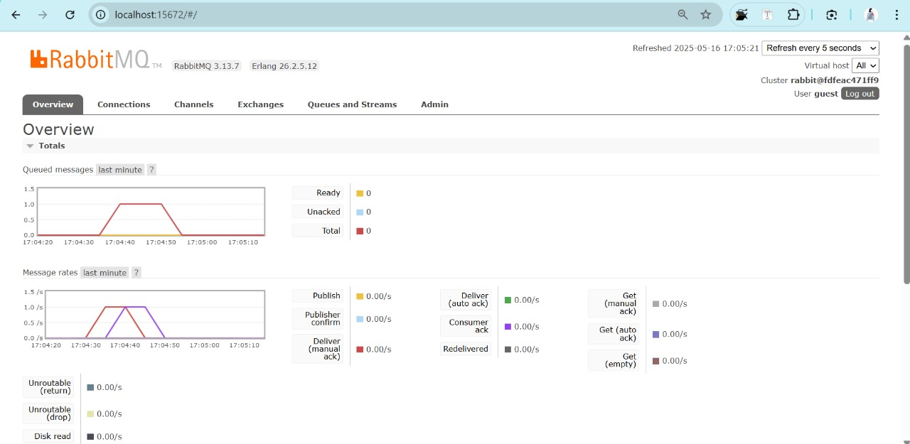

**Reflection Module 9 – Subscriber**

**a. What is AMQP?**
AMQP (Advanced Message Queuing Protocol) is a communication protocol that allows applications to exchange messages securely and independently via a queue, without needing to be active at the same time. It’s commonly used in microservices systems to send and receive messages asynchronously through a message broker like RabbitMQ. With AMQP, the sender (publisher) sends a message to the broker, and the receiver (subscriber) retrieves it from the queue. This setup makes the process more organized, reliable, and decoupled.

**b. What does `guest:guest@localhost:5672` mean?**
`guest:guest@localhost:5672` is a connection format for RabbitMQ. The first `guest` is the username, the second `guest` is the password, `localhost` indicates that the RabbitMQ server is running on the local machine, and `5672` is the default port used by the AMQP protocol. In other words, the application is trying to connect to RabbitMQ on the local computer using the default `guest` account.

### Simulation Slow Subscriber

On my computer, there are up to 2 queues. I ran the publisher twice in quick succession. The sending speed was faster than the receiving speed, causing the messages to be stored in the queue first before being received by the subscriber.
